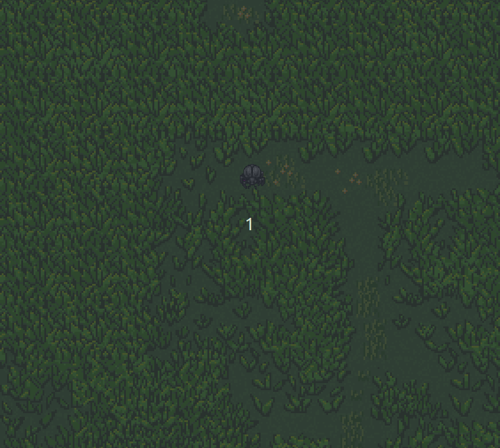

# go-ebiten-camera-demo

A detailed explanation on how to implement a 2d camera using the ebitenengine in go

The camera should support the following 
- zoom
- rotation
- position

## first commit

> d82626f1493cf90f5903179bbc0f9517c204a47b

This explains the a standard [ebitengine](https://ebitengine.org) game. 

You have your game struct in [game/game.go](game/game.go) satisfying the [ebiten.Game interface](https://pkg.go.dev/github.com/hajimehoshi/ebiten/v2#Game) and hand it over to the ebitengine in [main.go](main.go). Voilá, you have yourself a game :smile:

